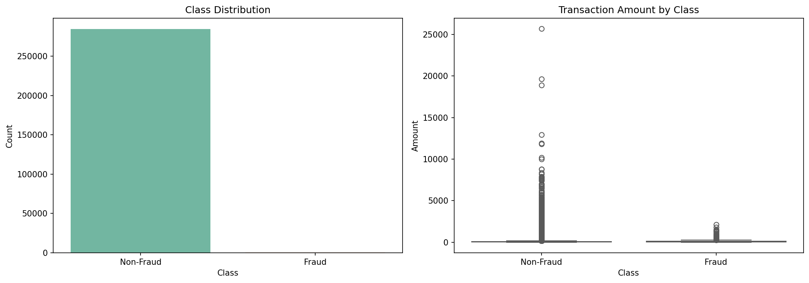
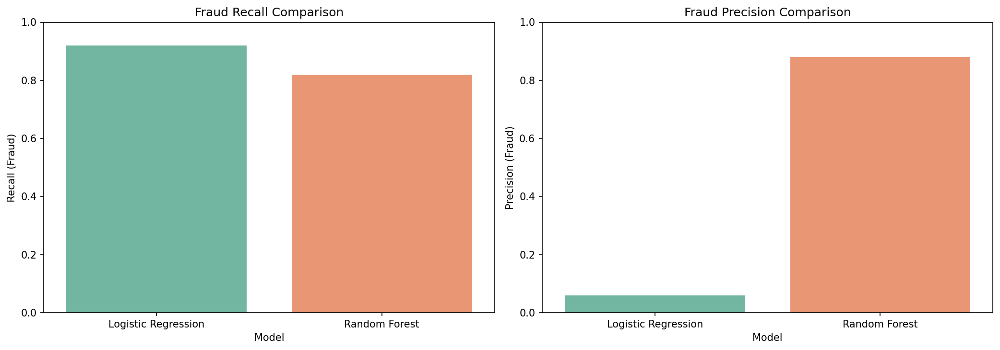
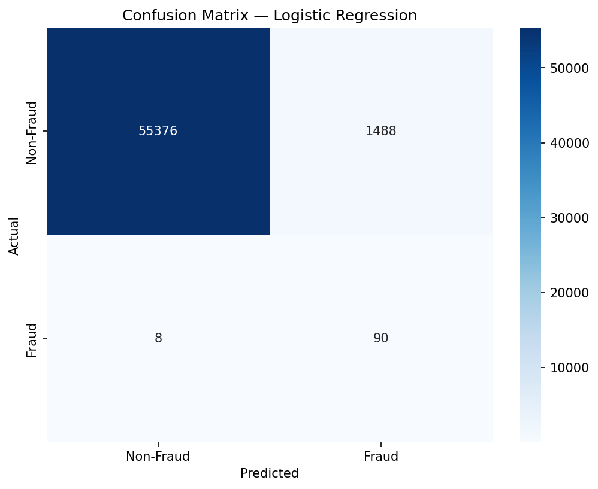
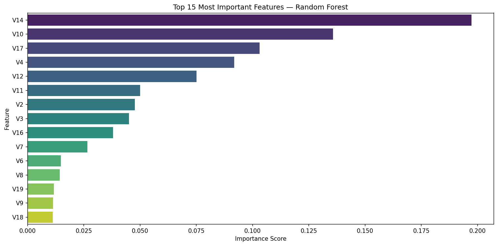

# 💳 Credit Card Fraud Detection

## Overview
An end-to-end Machine Learning project to detect fraudulent credit card transactions 
from a highly imbalanced real-world dataset of 284,807 transactions — where only 
0.173% are fraud.

The core challenge isn't just building a model — it's building the *right* model 
that minimizes missed fraudsters while keeping false alarms manageable.

**Author:** Yashkumar Sharma | B.E. Computer Engineering | Pursuing M.Tech in Operations Research  
**Tools:** Python, Pandas, Scikit-learn, Imbalanced-learn, Seaborn  
**Dataset:** [Credit Card Fraud Detection — Kaggle](https://www.kaggle.com/datasets/mlg-ulb/creditcardfraud)

---

## Problem Statement
Credit card fraud costs the global banking industry billions every year. 
Traditional rule-based systems struggle to keep up with evolving fraud patterns. 
This project builds an ML system that learns fraud patterns from historical data — 
while tackling the extreme class imbalance that makes this problem uniquely challenging.

---

## The Core Challenge — Class Imbalance

Out of 284,807 transactions — only 492 are fraud (0.173%). A model predicting 
"Not Fraud" for everything achieves 99.83% accuracy yet catches **zero fraudsters**. 
This is why accuracy is a misleading metric here — **Recall is what matters.**

---

## Methodology

### 1. Feature Engineering
Created 6 new meaningful features from raw `Time` and `Amount` columns:

| Feature | Description |
|---------|-------------|
| `hour` | Transaction hour of day |
| `is_night` | 1 if transaction between 10pm–6am |
| `amount_log` | Log transformed amount — reduces skewness |
| `amount_zscore` | How statistically unusual the amount is |
| `amount_rounded` | 1 if round number — common in fraud |
| `high_amount` | 1 if amount in top 5% |

### 2. Handling Class Imbalance — SMOTE
Applied SMOTE (Synthetic Minority Oversampling Technique) on training data only:
- **Before SMOTE:** 394 fraud vs 227,451 genuine
- **After SMOTE:** 227,451 fraud vs 227,451 genuine

SMOTE creates realistic synthetic fraud examples by interpolating between 
existing ones — giving the model enough variety to learn fraud patterns properly.

### 3. Model Building
Built and compared two models — Logistic Regression and Random Forest.

---

## Results

### Model Comparison

| Metric | Logistic Regression | Random Forest |
|--------|-------------------|---------------|
| Fraud Recall | **0.92** | 0.82 |
| Fraud Precision | 0.06 | **0.88** |
| False Positives | 1,488 | 11 |
| False Negatives | **8** | 18 |

### Confusion Matrix — Logistic Regression (Recommended)

### Feature Importance

**Key Finding:** V14, V10 and V17 dominate fraud detection. None of our 6 engineered 
features made the top 15 — confirming the bank's PCA preprocessing already captured 
the most meaningful signals.

---

## Threshold Tuning

| Threshold | Recall | Precision | Use Case |
|-----------|--------|-----------|----------|
| 0.5 (default) | 0.92 | 0.06 | Catch every fraudster |
| 1.0 (optimal F1) | 0.82 | 0.83 | Minimize false alarms |

Threshold selection is ultimately a **business decision** — not just a technical one.

---

## Business Recommendations

**Recommended Model: Logistic Regression**

In a banking environment, missing a fraudster is far more costly than 
flagging a genuine transaction for manual review. Logistic Regression catches 
92% of fraudsters — missing only 8 out of 98 fraud cases.

- **Prioritizing fraud catch rate** → Logistic Regression, default threshold (0.5)
- **Prioritizing customer experience** → Optimal threshold (1.0), fewer false alarms

---

## Future Improvements
- Experiment with XGBoost and LightGBM for better performance
- Combine SMOTE with undersampling for better balance
- Explore Isolation Forest — anomaly detection approach
- Apply GridSearchCV for hyperparameter optimization

---

## Project Structure
Credit-Card-Fraud-Detection/
│
├── ml-project.ipynb         # Main project notebook
├── images/                  # Visualization images
│   ├── class_distribution.png
│   ├── confusion_matrix_lr.png
│   ├── model_comparison.png
│   └── feature_importance.png
└── README.md                # Project documentation

---

## Author
**Yashkumar Sharma**  
B.E. Computer Engineering | Pursuing M.Tech in Operations Research  
[GitHub](https://github.com/Nexus1309) | [LinkedIn](linkedin.com/in/yashkumar-sharma-bb239a259)
